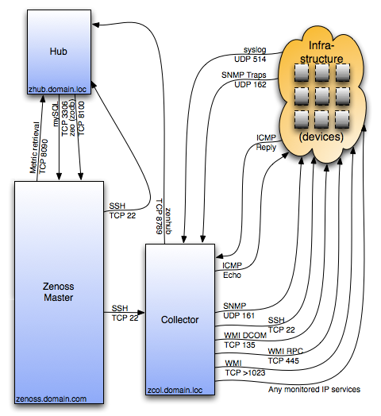

========================================================================
Custom Collectors and Custom Parsers
========================================================================

Collecting data is the fundamental goal of Zenoss. This section explores
specific tasks related to data collection and parsing that data.

    Zenoss Collector Subsystem

Prerequisites
------------------------------------------------------------------------------

* Zenoss ZenPack Developement Guide

We assume that you are familiar with ZenPack developement and Python coding.
We further assume that we work from the base of ZP_DIR.
For NetBotz for example::

  ZP_DIR_TOP=$ZENHOME/ZenPacks/ZenPacks.training.NetBotz
  ZP_DIR=$ZP_DIR_TOP/ZenPacks/training/NetBotz

As you should know, collectors and parsers typically live in the folder::

  $ZP_DIR/datasources
  $ZP_DIR/parsers

Debugging Tips in General
---------------------------------------------------
* Run the collector manually like this::

   zencommand run  -workers=0 -v10 -d mp3.zenoss.loc |& tee collect.log

* If you don't get any output, you can try these basic steps:

  - Restart zenhub: it may have given up loading the modeler
  - Rerun zencommand and also monitor /opt/zenoss/log/zenhub.log for good
    measure. You may want to run zenhub in the foreground.

* To test your parser command at a low level use::

    cd /opt/zenoss/Products/ZenHub/services
    python CommandPerformanceConfig.py -d mp1.zenoss.loc

General Background Information
------------------------------------------------------------------------

Collection process has the following steps:

* A collection process (a collector) is started, often with ZenCommand
  against a collector name (db2.zenoss.loc).
* The collector contacts Zenhub and load the commands to be run against
  devices for that collector (target)
* Zencommand runs the collection command on the remote target.
* If and when results are returned, a parser is created.
* Zencommand passes results to the processResults() method of the parser.
* The processResults() method is passed the command configuration fetched
   from ZenHub, and also an object into which parsed results will be placed.
* Zencommand takes the returned Python dictionary from the parser and updates
  the ZODB

.. math:: 

  \begin{array}{ccccc}
   HOST_a    &                       &Collect(targets)&\xrightarrow{a} & (Results)        \\
  \downarrow &                       & \uparrow_a     &                & \downarrow       \\
  \fbox{ZC/ZP}&^a_b\rightleftharpoons&\fbox{Zenhub}   &\xleftarrow[b]{}& (Parser, Result) \\
  \downarrow_b&                      &                &                &                  \\
  \fbox{ZODB}&                       &                &                &                  \\
  \end{array}

Ref: http://docs.huihoo.com/zenoss/dev-guide/2.4.2/ch12s05.html

Collectors/Pollers
###################

Collection can happen with a native plugin like [ssh, snmp, ping, https, etc.] or a
custom plugin that you create. The output can come back in several formats like
[Nagios, Cacti, JSON] or a custom format that you specify. Custom formats
must be handled by you using a *custom parser*.

Sometimes we refer to collectors as *pollers* or *collection plugins*. Since the 
collector/plugin information is passed to Zenhub, it must be an exectuable
program or script.

An example of a custom poller that outputs JSON is shown below.
The example is pilfered from ZenPacks.zenoss.DB2. Note the following:

* The poller is self-contained and self-calling. There are no *magic* functions
  that Zenoss calls automatically.

* The poller can import from global and local modules

* You normally setup your plugins in your __init__.py so that they
  have proper scope and permissions at installation.

* In your *Monitoring Templates* setup, you must use the
  "COMMAND" type for this datasource.

* When you specify the datasource command, you will have to specifiy the
  **full** path (using TALES) to the poller. For example:
  ${here/ZenPackManager/packs/ZenPacks.zenoss.DB2/path}/poll_db2.py
  
* See the PostgreSQL, DB2, and DatabaseMonitor zenpacks for more examples.

.. code-block:: python
   :linenos:
   :emphasize-lines: 4

   #!/usr/bin/env python
   import sys
   from lib import txdb2jdbc

   class db2Poller(object):
    _connectionString = None     # DB2 JDBC ConnectionStrings only
    _query = None                # A Valid DB2 SQL query
    _data = None                 # This is JSON data from Java connector

    def __init__(self, conString, myQuery):
        self._connectionString = conString
        self._query = myQuery

    def getData(self):
        db2 = txdb2jdbc.Database(self._connectionString)
        self._data = db2.query_json(self._query)
        return self._data

    def printJSON(self):
        data = None
        try:
            data = self.getData()

        except Exception, ex:
            print "Exception", ex
        print data

    if __name__ == '__main__':
        usage = "Usage: {0} <connectionString> <query>"
        connectionString = None

        try:
            connectionString = sys.argv[1]
            query = sys.argv[2]

        except IndexError:
            print "poll_db2 : insufficient parameters"
            print >> sys.stderr, usage.format(sys.argv[0])
            sys.exit(1)

        except ValueError:
            print >> sys.stderr, usage.format(sys.argv[0])
            sys.exit(1)

        poller = db2Poller(connectionString, query)
        poller.printJSON()

Custom Parsers
##############

The *parser* is invoked after a successful collection has occured.
If you are not using one of the standard parsers like [Nagios, Cacti, JSON],
then you must create your own custom parser.

Custom parsers usually are located in the *$ZP_DIR/parsers* folder. Whatever parser
you create can only be used when configured for the *datasource* (for your
device) in the **Monitoring Templates** area. This information is typically
stored in the *$ZP_DIR/objects/objects.xml* file. 

Our example is from the DatabaseMonitor zenpack (OracleDB):

* Starting on line 10 we see the *processResults()* method definition.
* On line 13, we try to determine if the returned data is valid data.
* On line 38, we start to process the validated data
* At 55, we return results determined by status returned from probed targets
* Finally on line 69, we update our datapoints.

.. code-block:: python
   :emphasize-lines: 10,13,38,55,69
   :linenos:

   # --------------------------------------------------------------------------
   # File: $ZP_DIR/parsers/tablespaces.py -------------------------------------
   # --------------------------------------------------------------------------
   import json

   from Products.ZenRRD.CommandParser import CommandParser
   from ZenPacks.zenoss.DatabaseMonitor.lib import locallibs

   class tablespace(CommandParser):
       def processResults(self, cmd, result):

        data = None
        try:
            data = json.loads(cmd.result.output)
            # Auto-clear if possible
            result.events.append({
                'severity': 0,
                'summary': 'Command parser status',
                'eventKey': 'tablespace.parser.key',
                'eventClassKey': 'tablespace.parse.class',
                'component': cmd.component,
                })
        except Exception, ex:
            result.events.append({
                'severity': cmd.severity,
                'summary': 'Command parser status',
                'eventKey': 'tablespace.parser.key',
                'eventClassKey': 'tablespace.parse.class',
                'command_output': cmd.result.output,
                'component': cmd.component,
                'exception': str(ex),
                })

            return result

        # Data is a list of dict: Iterate over them to find the right row
        tbsp = None
        for row in data:
            if tbsp is not None:
                break

            inst_name = row['INSTANCE_NAME']
            tbsp_name = row['TABLESPACE_NAME']
            component_id = '{0}_{1}'.format(inst_name, tbsp_name)

            # Select the correct row here. Break when found. Set Status
            if component_id == cmd.component:
                tbsp = row

                # If the TS reports an error, mark it as Critical.
                ts_message = 'Tablespace Status is: %s' % tbsp['ONLINE_STATUS']

                severity = locallibs.tbsp_status_map(tbsp['ONLINE_STATUS'])

                result.events.append({
                    'severity': severity,
                    'summary': ts_message,
                    'eventKey': 'tablespace.status.Key',
                    'eventClassKey': 'oracle.tablespace.ClassKey',
                    'eventClass': "/Status",
                    'component': component_id,
                    })

                break    # Break the "for row" , component found.

        #----------------------------------------------------------------------
        # Update/Filter on all datapoints. No need to check for non-numericals.
        #----------------------------------------------------------------------
        for point in cmd.points:
            if tbsp and point.id in tbsp:
                result.values.append((point, tbsp[point.id]))

        return result

