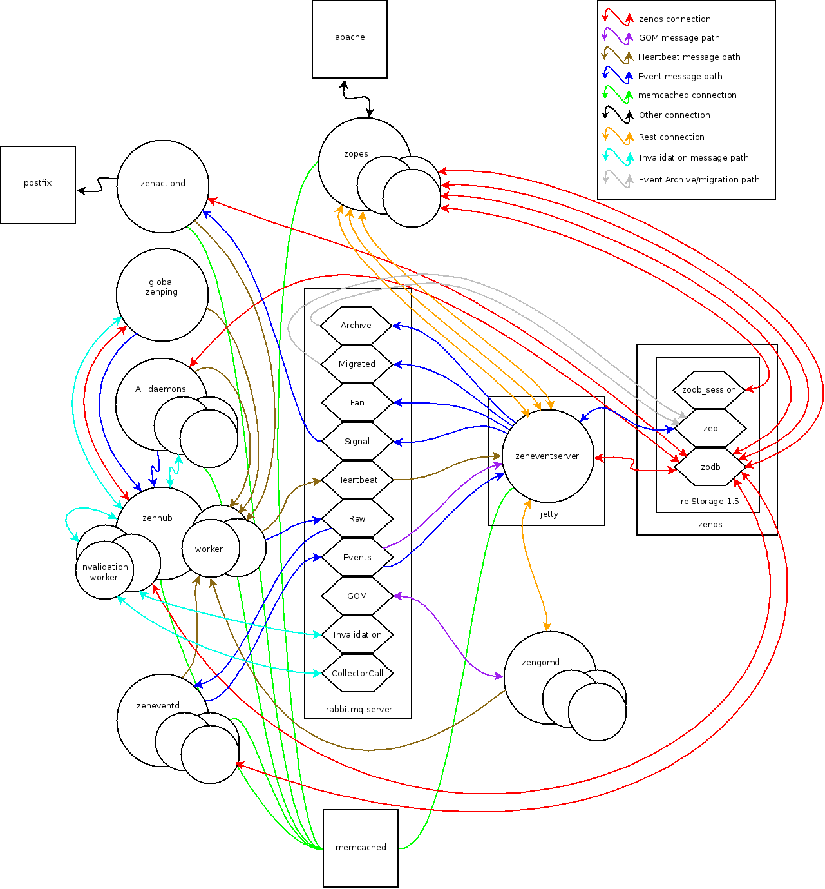

General Considerations
=========================

Get yourself a good IDE and copy of both the core code and
a few zenpacks to look at. 

Here is a picture of the overall Zenoss processes.
You will need to have a rudimentary understanding of this.

   Zenoss Flow Chart
