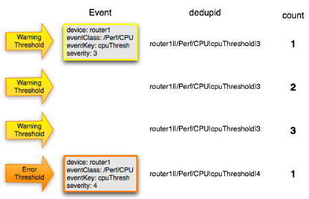
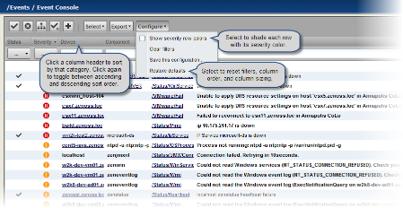
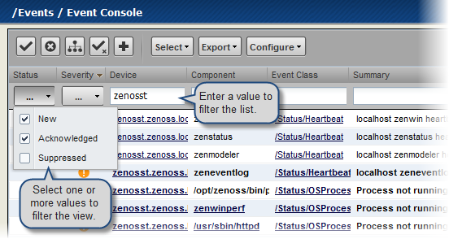
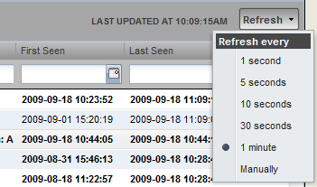
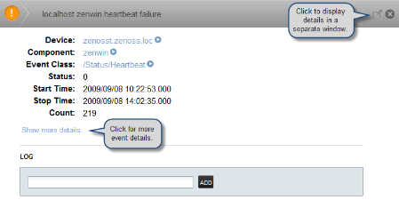
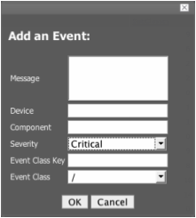
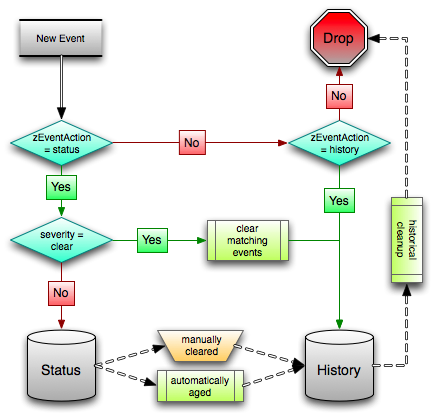

Event Management
=================

About Events
------------------

Events, and the graphs generated from performance monitoring, are the
primary operational tools for understanding the state of your
environment. This chapter defines events and describes the Zenoss event
management system.

Basic Event Fields
~~~~~~~~~~~~~~~~~~~~~~~~~~

To enter the Zenoss event management system, an event must contain
values for the device, severity, and summary fields. If an event is
missing any of these fields, then Zenoss rejects it.

Basic event fields are:

-  device
-  ipAddress
-  eventState
-  severity
-  summary
-  message
-  evid

device and ipAddress Fields
^^^^^^^^^^^^^^^^^^^^^^^^^^^^^^^^^^^^^

The device field is a free-form text field that allows up to 128
characters. Zenoss accepts any value for this field, including devices
that are not in the database. If the device field contains an IP
address, then Zenoss queries the database for devices with a matching
address. If it finds a match, it changes the device field to the found
device name.

The ipAddress field is a free-form text field that allows up to 15
characters. This field is not required. If Zenoss cannot successfully
locate a device based on the event's device field content, it attempts
to find the device based the event ipAddress field content, if present.

Zenoss automatically adds information to incoming events that match a
device in its database. Fields added are:

-  **prodState** - Specifies the device's current production state.

-  **Location** - Specifies the location (if any) to which the device is
   assigned.

-  **DeviceClass** - Classifies the device.

-  **DeviceGroups** - Specifies the groups (if any) to which the device
   is assigned.

-  **Systems** - Systems (if any) to which the device is assigned.

-  **DevicePriority** - Priority assigned to the device.

For more information about these fields, refer to the chapters titled
"Production States and Maintenance Windows" and "Organizers and Path
Navigation."

eventState Field
^^^^^^^^^^^^^^^^^^^^^^^^^^

The eventState field defines the current state of the event. This field
is often updated after an event has been created. Values for this
numeric field are 0-2, defined as follows:

+----------+----------------+
| Number   | Name           |
+==========+================+
| 0        | New            |
+----------+----------------+
| 1        | Acknowledged   |
+----------+----------------+
| 2        | Suppressed     |
+----------+----------------+

severity Field
^^^^^^^^^^^^^^^^^^^^^^^^

The severity field defines the severity of the event. Values for this
numeric field are 0-5, defined as follows:

+----------+------------+----------+
| Number   | Name       | Color    |
+==========+============+==========+
| 0        | Clear      | Green    |
+----------+------------+----------+
| 1        | Debug      | Grey     |
+----------+------------+----------+
| 2        | Info       | Blue     |
+----------+------------+----------+
| 3        | Warning    | Yellow   |
+----------+------------+----------+
| 4        | Error      | Orange   |
+----------+------------+----------+
| 5        | Critical   | Red      |
+----------+------------+----------+

summary and message Fields
^^^^^^^^^^^^^^^^^^^^^^^^^^^^^^^^^^^^

The summary and message fields are free-form text fields. The summary
field allows up to 128 characters. The message field allows up to 65535
characters. These fields usually contain similar data.

Zenoss handles these fields differently, depending on whether one or
both are present on an incoming event:

-  If only summary is present, then Zenoss copies its contents into
   message and truncates summary contents to 128 characters.

-  If only message is present, then Zenoss copies its contents into
   summary and truncates summary contents to 128 characters.

-  If summary and message are both present, then Zenoss truncates
   summary contents to 128 characters.

As a result, data loss is possible only if the message or summary
content exceeds 65535 characters, or if both fields are present and the
summary content exceeds 128 characters.

To ensure that enough detail can be contained within the 128-character
summary field limit, avoid reproducing information in the summary that
exists on other fields (such as device, component, or severity).

evid
^^^^^^^^^^^^^^

The evid field is the event identifier, or event ID. It is a
36-character, unique identifier for every event that comes into the
system. An incoming event should never have an evid assigned to it,
because Zenoss creates it immediately before the event is inserted into
the database. If an incoming event does have an assigned evid, then
Zenoss ignores it and replaces it with a generated evid.

Other Fields
~~~~~~~~~~~~~~~~~~~~

Zenoss events include numerous other standard fields. Some control how
an event is mapped and correlated; others provide information about the
event.

The following table lists additional event fields.

+---------------------+-----------------------------------------------------------------------------------------------------------------------------------------------------------------------------------------------------------+
| Field               | Description                                                                                                                                                                                               |
+=====================+===========================================================================================================================================================================================================+
| depuid              | Dynamically generated fingerprint that allows Zenoss to perform de-duplication on repeating events that share similar characteristics.                                                                    |
+---------------------+-----------------------------------------------------------------------------------------------------------------------------------------------------------------------------------------------------------+
| component           | Free-form text field (maximum 255 characters) that allows additional context to be given to events (for example, the interface name for an interface threshold event).                                    |
+---------------------+-----------------------------------------------------------------------------------------------------------------------------------------------------------------------------------------------------------+
| eventClass          | Name of the event class into which this event has been created or mapped.                                                                                                                                 |
+---------------------+-----------------------------------------------------------------------------------------------------------------------------------------------------------------------------------------------------------+
| eventKey            | Free-form text field (maximum 128 characters) that allows another specificity key to be used to drive the de-duplication and auto-clearing correlation process.                                           |
+---------------------+-----------------------------------------------------------------------------------------------------------------------------------------------------------------------------------------------------------+
| eventClassKey       | Free-form text field (maximum 128 characters) that is used as the first step in mapping an unknown event into an event class.                                                                             |
+---------------------+-----------------------------------------------------------------------------------------------------------------------------------------------------------------------------------------------------------+
| eventGroup          | Free-form text field (maximum 64 characters) that can be used to group similar types of events. This is primarily an extension point for customization. Currently not used in a standard Zenoss system.   |
+---------------------+-----------------------------------------------------------------------------------------------------------------------------------------------------------------------------------------------------------+
| stateChange         | Last time that any information about the event changed.                                                                                                                                                   |
+---------------------+-----------------------------------------------------------------------------------------------------------------------------------------------------------------------------------------------------------+
| firstTime           | First time that the event occurred.                                                                                                                                                                       |
+---------------------+-----------------------------------------------------------------------------------------------------------------------------------------------------------------------------------------------------------+
| lastTime            | Most recent time that the event occurred.                                                                                                                                                                 |
+---------------------+-----------------------------------------------------------------------------------------------------------------------------------------------------------------------------------------------------------+
| count               | Number of occurrences of the event between the firstTime and lastTime.                                                                                                                                    |
+---------------------+-----------------------------------------------------------------------------------------------------------------------------------------------------------------------------------------------------------+
| prodState           | Production state of the device when the event occurred. If an event is still active when a device's production state is changed, the event's prodState will be updated accordingly.                       |
+---------------------+-----------------------------------------------------------------------------------------------------------------------------------------------------------------------------------------------------------+
| suppid              | If this event has been suppressed by another event, then suppid contains the other event's evid.                                                                                                          |
+---------------------+-----------------------------------------------------------------------------------------------------------------------------------------------------------------------------------------------------------+
| manager             | Deprecated. The monitor field replaces this field.                                                                                                                                                        |
+---------------------+-----------------------------------------------------------------------------------------------------------------------------------------------------------------------------------------------------------+
| agent               | Typically the name of the daemon that generated the event. For example, an SNMP threshold event will have zenperfsnmp as its agent.                                                                       |
+---------------------+-----------------------------------------------------------------------------------------------------------------------------------------------------------------------------------------------------------+
| DeviceClass         | Device class of the device that the event is related to.                                                                                                                                                  |
+---------------------+-----------------------------------------------------------------------------------------------------------------------------------------------------------------------------------------------------------+
| Location            | Location of the device that the event is related to.                                                                                                                                                      |
+---------------------+-----------------------------------------------------------------------------------------------------------------------------------------------------------------------------------------------------------+
| Systems             | Pipe-delimited list of systems that the device is contained within.                                                                                                                                       |
+---------------------+-----------------------------------------------------------------------------------------------------------------------------------------------------------------------------------------------------------+
| DeviceGroups        | Pipe-delimited list of systems that the device is contained within.                                                                                                                                       |
+---------------------+-----------------------------------------------------------------------------------------------------------------------------------------------------------------------------------------------------------+
| facility            | Only present on events coming from syslog. The syslog facility.                                                                                                                                           |
+---------------------+-----------------------------------------------------------------------------------------------------------------------------------------------------------------------------------------------------------+
| priority            | Only present on events coming from syslog. The syslog priority.                                                                                                                                           |
+---------------------+-----------------------------------------------------------------------------------------------------------------------------------------------------------------------------------------------------------+
| ntevid              | Only present on events coming from Windows event log. The NT Event ID.                                                                                                                                    |
+---------------------+-----------------------------------------------------------------------------------------------------------------------------------------------------------------------------------------------------------+
| ownerid             | Name of the user who acknowledged this event.                                                                                                                                                             |
+---------------------+-----------------------------------------------------------------------------------------------------------------------------------------------------------------------------------------------------------+
| clearid             | Only present on events in history that were auto-cleared. The evid of the event that cleared this one.                                                                                                    |
+---------------------+-----------------------------------------------------------------------------------------------------------------------------------------------------------------------------------------------------------+
| DevicePriority      | Priority of the device that the event is related to.                                                                                                                                                      |
+---------------------+-----------------------------------------------------------------------------------------------------------------------------------------------------------------------------------------------------------+
| eventClassMapping   | If this event was matched by one of the configured event class mappings, contains the name of that mapping rule.                                                                                          |
+---------------------+-----------------------------------------------------------------------------------------------------------------------------------------------------------------------------------------------------------+
| monitor             | In a distributed setup, contains the name of the collector from which the event originated.                                                                                                               |
+---------------------+-----------------------------------------------------------------------------------------------------------------------------------------------------------------------------------------------------------+

Details
~~~~~~~~~~~~~~~

In addition to the standard fields, Zenoss also allows events to add an
arbitrary number of additional name/value pairs to events to give them
more context. The name and value of these details are limited to 255
characters in length.

De-Duplication
~~~~~~~~~~~~~~~~~~~~~~

Zenoss uses an event "de-duplication" feature, based on the concept of
an event's fingerprint. Within Zenoss, this fingerprint is the "depuid."
All of the standard events that Zenoss creates as a result of its
polling activities are de-duplicated, with no setup required. However,
you can apply de-duplicating to events that arrive from other sources,
such as syslog, SNMP traps, or a Windows event log.

The most important de-duplication concept is the *fingerprint*. In all
cases, an event's fingerprint (or dedupid) is composed of a
pipe-delimited string that contains these event fields:

-  device

-  component (can be blank)

-  eventClass

-  eventKey (can be blank)

-  severity

-  summary (omitted from the dedupid if eventKey is non-blank)

When the component and eventKey fields are blank, a dedupid appears
similar to:

www.example.com\|\|/Status/Web\|\|4\|WebTx check failed

When the component and eventKey fields are present, a dedupid appears
similar to:

router1.example.com\|FastEthernet0/1\|/Perf/Interface\|threshName

When a new event comes into the system, the dedupid is constructed. If
it matches the dedupid for any active event, the existing event's count
field is incremented by one, and its lastTime field is updated to be the
current time. If it does not match the dedupid of any active events,
then it is inserted into the active event table with a count of 1, and
the firstTime and lastTime fields are set to the current time.

The following illustration depicts a de-duplication scenario in which an
identical event occurs three times, followed by one that is different in
a single aspect of the dedupid fingerprint.

   Event De-Duplication

If you want to change the way de-duplication behaves in Zenoss, you can
use an event transform to alter one of the fields used to build the
dedupid. You also can use a transform to directly modify the dedupid
field, for more powerful cross-device event de-duplication.

Auto-Clear Correlation
~~~~~~~~~~~~~~~~~~~~~~~~~~~~~~

Zenoss' auto-clearing feature is similar to its de-duplication feature.
It also is based on the event's fingerprint. The difference is which
event fields make up the fingerprint, and what happens when a new event
matches an existing event's fingerprint.

All of the standard events that Zenoss creates as a result of its
polling activities do auto-clearing by themselves. As with
de-duplication, you would invoke auto-clearing manually only to handle
events that come from other sources, such as syslog, a Windows event
log, or SNMP traps.

The auto-clear fingerprint for an event is built by using the
combination of these fields:

-  device

-  component (can be blank)

-  eventKey (can be blank)

-  eventClass (including zEventClearClasses from event class
   zProperties)

When a new event comes into Zenoss with a special 0 (Clear) severity,
Zenoss checks all active events to see if they match the auto-clear
fingerprint of the new event. All active events that match the
auto-clear fingerprint are moved from the active events table to
history, and their clearid field is set to the evid of the event that
cleared them.

If an event is cleared by the clear event, it is also inserted into the
event history; otherwise, it is dropped. This is done to prevent
extraneous clear messages from filling your events database.

The following illustration depicts a standard ping down event and its
associated clear event.

.. figure:: _static/Event_Auto_Clear.png

   Event Auto Clearing

If you need to manually invoke the auto-clearing correlation system, you
can use an event transform to make sure that the clear event has the 0
(Clear) severity set. You also need to ensure that the device,
component, and eventClass fields match the events you intend to clear.

Note
~~~~

Avoid making clear events too generic; otherwise, you may inadvertently
clear a wider variety of events that you intend.

Event Consoles
~~~~~~~~~~~~~~~~~~~~~~

Zenoss features multiple event consoles that allow you to view and
manage events. Each console shows different events subsets, depending on
your current context.

Zenoss event consoles are:

-  **Master** - To access this console, click Event Console in the
   Navigation menu. You can view all events from this console.

-  **Custom** - Users can create custom event consoles from the Event
   Views tab within their user preferences. Each custom event console
   has access to the same events as the global console, but can be
   filtered more specifically (from the Edit tab).

-  **Contextual** - Contextual event consoles are found throughout
   Zenoss. Each time you see an Events tab on a device, device
   organizer, component, or event class, you can view event information
   that has been automatically filtered to show events specific to the
   current context.

The master event console is Zenoss' central nervous system, enabling you
to view and manage events. It displays the repository of all events that
have been collected by the system.

   Event Console

Sorting and Filtering Events
^^^^^^^^^^^^^^^^^^^^^^^^^^^^^^^^^^^^^^

You can sort and filter events that appear in the event console to
customize your view.

You can sort events by any column that appears in the event console. To
sort events, click a column header. Clicking the header toggles between
ascending and descending sort order.

Filter options appear below each column header.

   Event Console Filter Options

You can filter the events that appear in the list in several ways,
depending on the field type. Date fields (such as First Seen and Last
Seen) allow you to enter a value or use a date selection tool to limit
the list. For other fields, such as Device, Component, and Event Class,
enter a match value to limit the list.

The Count field allows you to filter the list when compared to a value:

-  *n* - Displays events with counts greater than or equal to that
   value.

-  ``<``\ *n* - Displays events with counts less than that value.

-  ``<=``\ *n* - Displays events with counts less than or equal to that
   value.

-  ``=``\ *n* - Displays events with counts equal to that value.

To clear filters, select **Configure > Clear filters**.

saving a custom view
^^^^^^^^^^^^^^^^^^^^^^^^^^^^^^

you can save your custom event console view by bookmarking it for quick
access later. to do this:

#. select **configure > save this configuration**.

   a dialog containing a link to the current view appears.

#. click and drag the link to the bookmarks link on your browser's menu
   bar.

   zenoss adds a link titled "event console" to your bookmarks list.

.. figure:: _static/event_console_save_configuration.png

   saving a custom view (bookmark)**

**tip**: you may want to re-title the bookmark, particularly if you
choose to save more than one event console view.

Refreshing the View
^^^^^^^^^^^^^^^^^^^^^^^^^^^^^

You can refresh the list of events manually or specify that they refresh
automatically. To manually refresh the view, click **Refresh**. You can
manually refresh at any time, even if you have an automatic refresh
increment specified.

To set up automatic refresh, select one of the time increments from the
Refresh list.

   Automatic Refresh Selections

Viewing Event Details
^^^^^^^^^^^^^^^^^^^^^^^^^^^^^^^

You can view details for any event in the system. To view details,
double-click an event row.

**Tip:** Be sure not to click other links in the row. These go to other
pages.

The Event Details area appears.

   Event Details

To see more information about the event, click Show more details. To
display the event information in a new window, click the icon located at
the top right.

You can use the Log area to add specific information about the event.
Enter details, and then click **Add**.

Selecting Events
^^^^^^^^^^^^^^^^^^^^^^^^^^

To select one or more events in the list, you can:

-  Click a row to select a single event

-  Ctrl-Click rows to select multiple events, or Shift-Click to select a
   range of events

-  Click Select to select all, none, new, acknowledged, or suppressed
   events

Acknowledging Events
^^^^^^^^^^^^^^^^^^^^^^^^^^^^^^

You may want to mark an event as "acknowledged" to indicate, for
example, that you have taken action to remedy a problem. To mark events
as acknowledged:

#. Select one or more events in the event console view.

#. Click 
.. image:: _static/acknowledge_button.png

   A check mark appears for each acknowledged event.

Returning Events to New Status
^^^^^^^^^^^^^^^^^^^^^^^^^^^^^^^^^^^^^^^^

You may want to return a previously acknowledged event to "new" status
(revoke its "acknowledged" status). To do this:

#. Select one or more events in the event console view.

#. Click 

A check mark no longer appears in the event row, and the event is
returned to "new" status.

Classifying Events
^^^^^^^^^^^^^^^^^^^^^^^^^^^^

Classifying events lets you associate one or more events with a specific
event class. To classify events:

#. Select one or more events in the event console view.

#. Click 

The Classify Events dialog appears.

#. Select an event class from the list of options, and then click
   **Submit**.

Note
~~~~

You can also classify events from event history.

Exporting Event Data
^^^^^^^^^^^^^^^^^^^^^^^^^^^^^^

You can export data from the event console to a comma-separated value
(``.csv``) or XML file. To do this, select **Export > CSV** or **Export
> XML**. By default, the exported file is named
``events.``\ *Extension.*

Moving Events to History (Close)
^^^^^^^^^^^^^^^^^^^^^^^^^^^^^^^^^^^^^^^^^^^

When you no longer want to actively monitor event (such as after you
acknowledge it, for example), you can move it to history. To do this:

#. Select one or more events in the event console view.

#. Click 

The selected events are moved to history.

To view events in history, click the Event History link (located at the
bottom left of the Event Console page).

Returning Events to Active Status
^^^^^^^^^^^^^^^^^^^^^^^^^^^^^^^^^^^^^^^^^^^^

You can return events that have been moved to history to active status.
When you do this, the events reappear in the event console.

To return events in history to active status:

#. Click Event History to go to the event history page.

#. Select one or more events.

#. Click 

.. image:: _static/event_history_make_active_button.png

The selected events are returned to active status and appear in the
event console.

Creating Events
^^^^^^^^^^^^^^^^^^^^^^^^^^

To create events from the event console, click

.. image:: _static/add_button.png

For more information about manual event creation, see the section titled
"Creating Events Manually."

Event Sources
~~~~~~~~~~~~~~~~~~~~~

Events come into Zenoss in two ways. *Generated events* are created as a
result of active polling. *Captured events* are transmitted by external
actions into Zenoss.

Generated Events
^^^^^^^^^^^^^^^^^^^^^^^^^^

These standard daemons are responsible for generating events in Zenoss.
They automatically perform appropriate de-duplication and auto-clearing.

-  **zenping** - Ping up/down events
-  **zenstatus** - TCP port up/down events
-  **zenperfsnmp** - SNMP agent up/down events, threshold events
-  **zencommand** - Generic status events, threshold events
-  **zenprocess** - Process up/down events, threshold events
-  **zenwin** - Windows service up/down events

Captured Events
^^^^^^^^^^^^^^^^^^^^^^^^^

Captured events are those events that Zenoss does not specifically know
will occur in advance. De-duplication is performed on these events, but
in some cases may need to be tuned. By default, no auto-clearing is done
on captured events. Event transforms must be used to create the
auto-clear correlations.

These standard daemons are responsible for collecting captured events:

-  **zensyslog** - Events created from syslog messages.
-  **zentrap** - Events created from SNMP traps and informs.
-  **zeneventlog** - Events created from the Windows event log.

There are a number of APIs available for submitting events into Zenoss.
For more information, see the *Zenoss Developer's Guide*.

Any ZenPacks you install may optionally include their own daemons. For
more information, see *Zenoss Extended Monitoring*.

Creating Events Manually
~~~~~~~~~~~~~~~~~~~~~~~~~~~~~~~~

You can manually create events. While this is not something you would do
as part of normal Zenoss operation, it can be helpful when you are
attempting to test mappings and transforms you have created.

Creating Events through the User Interface
^^^^^^^^^^^^^^^^^^^^^^^^^^^^^^^^^^^^^^^^^^^^^^^^^^^^

To create events manually through the user interface:

#. Navigate to Events, and then select Add Event from the table menu.

Note
~~~~

   You also can create events from the Event Console.

   The Add an Event dialog appears.

   Add Event Dialog

#. Complete the basic event fields. If you want any event class mappings
   to be applied to the event you are creating, you must select the
   blank Event Class (rather than the default /). Event class mappings
   are applied only for events that do not already have an event class.

Creating Events from the Command Line
^^^^^^^^^^^^^^^^^^^^^^^^^^^^^^^^^^^^^^^^^^^^^^^

To send events from the command line, use the zensendevent script, in
this format:

.. code:: programlisting

   zensendevent Options summary

Common options include:

-  -d DEVICE, --device=DEVICE
-  -i IPADDRESS, --ipAddress=IPADDRESS
-  -y EVENTKEY, --eventkey=EVENTKEY
-  -p COMPONENT, --component=COMPONENT
-  -k EVENTCLASSKEY, --eventclasskey=EVENTCLASSKEY
-  -s SEVERITY, --severity=SEVERITY
-  -c EVENTCLASS, --eventclass=EVENTCLASS

Example
'''''''''''''''''''

The following example shows how to use the zensendevent script to
simulate a ping down event:

.. code:: programlisting

    zensendevent -d router1.example.com -s Critical -c /Status/Ping "Router down"

Event Classes
~~~~~~~~~~~~~~~~~~~~~

Zenoss *event classes* are a simple organizational structure for the
different types of events that Zenoss generates and receives. This
organization is useful for driving alerting and reporting. You can, for
example, create an alerting rule that sends you an email or pages you
when the availability of a Web site or page is affected by filtering on
the /Status/Web event class.

Following is a subset of the Zenoss default event classes. You can
create additional event classes as needed.

-  /Status - Used for events affecting availability.

   -  /Status/Ping - Ping up/down events

   -  /Status/Snmp - SNMP up/down events

   -  /Status/Web - Web site or page up/down events

-  /Perf - Used for performance threshold events.

   -  /Perf/CPU - CPU utilization events

   -  /Perf/Memory - Memory utilization or paging events

   -  /Perf/Interface - Network interface utilization events

   -  /Perf/Filesystem - File system usage events

-  /App - Application-related events.

-  /Change - Events created when Zenoss finds changes in your
   environment.

Event Class zProperties
^^^^^^^^^^^^^^^^^^^^^^^^^^^^^^^^^

Just as device classes and devices have zProperties, so do event classes
and event class mappings. zProperties are applied hierarchically, with
the most specific zProperty being applied.

The following zProperties are available on event classes and even class
mappings.

-  **zEventAction** - How and where affected events are stored when they
   occur.

   -  **status** - Active events table

   -  **history** - Historical event table

   -  **drop** - Events are not stored

-  **zEventClearClasses** - Optional list of event class names whose
   active events will be cleared by clear events occurring in this
   class.

-  **zEventSeverity** - The severity of affected events is changed to
   this value unless the Original value is used.

A good example of how Zenoss uses the event class zProperties is found
in the /Change event class. Within the /Change event class' zProperties,
zEventAction is set to drop and zEventSeverity is set to Info. This
configuration causes all of the changes in your environment to be stored
as info severity events in the history table.

For more information about event manipulation techniques, see the
section titled "Mapping and Transformation."

Mapping and Transformation
~~~~~~~~~~~~~~~~~~~~~~~~~~~~~~~~~~~

Zenoss' event mapping and transformation system allows you to perform a
wide range of operations, from altering the severity of certain events
to altering nearly every field on an event, based on complex rules.

You cannot alter the following fields through event transformation.
(This is because they are set after transformation has been performed.)

-  evid

-  firstTime

-  lastTime

-  count

The following illustration shows the path followed by an incoming event
in the event mapping system.

.. figure:: _static/Event Processing.png

    Event Processing

The mapping and transformation process begins with the "eventClass field
exists" decision. This also is one of the more important differentiators
in how you must handle a particular type of event.

Event Class Mappings
^^^^^^^^^^^^^^^^^^^^^^^^^^^^^^^

There are two primary ways to view the event class mappings that exist
in the system. The first is to go to Events in the navigation menu and
click on the Mappings tab. This allows you to see all event class
mappings in a single location. The EventClass column shows which event
class the mapping is in. The other way to view the existing event class
mappings is to go to the Classes tab of any event class. This shows you
only event class mappings related to the current event class.

You can create event class mappings directly from the event classes, but
this requires that you know the eventClassKey. A simpler way to create
event class mappings is through the event console. Find an event that
you want to match, select it, and then click **Classify**. Choose the
event class that you want the event to be mapped to, and then click
**OK**. This will automatically create the event class mapping with the
correct eventClassKey, and example text against which you potentially
can developer your regular expression.

From the Edit tab of an event class mapping, you can control which
events it will match, as well as other properties:

-  **Name** - An identifier for this event class mapping. Not important
   for matching events.

-  **Event Class Key** - Must match the incoming event's eventClassKey
   field for this mapping to be considered as a match for events.

-  **Sequence** - Sequence number of this mapping, among mappings with
   an identical event class key property. Go to the Sequence tab to
   alter its position.

-  **Rule** - Provides a programmatic secondary match requirement. It
   takes a Python expression. If the expression evaluates to True for an
   event, this mapping is applied.

-  **Regex** - The regular expression match is used only in cases where
   the rule property is blank. It takes a Perl Compatible Regular
   Expression (PCRE). If the regex matches an event's message field,
   then this mapping is applied.

-  **Transform** - Takes Python code that will be executed on the event
   only if it matches this mapping. For more details on transforms, see
   the section titled "Event Class Transform."

-  **Explanation** - Free-form text field that can be used to add an
   explanation field to any event that matches this mapping.

-  **Resolution** - Free-form text field that can be used to add a
   resolution field to any event that matches this mapping.

The sequence tab of an event class mapping allows you to handle
situations where you need to provide more than one possible mapping for
the same eventClassKey. In this case, the sequence is evaluated in
ascending order until a full (rule or regex) match is found.

Mappings have the same zProperties as event classes. Any zProperty set
locally on a mapping will override the same property set on the event
class. This works in the same hierarchical, most specific match, concept
that device class and device zProperties work.

When a captured event (see the section titled "Event Sources") occurs,
it will not have an event class pre-defined. For this type of event, you
must create an event class mapping if you want to affect the event. If a
captured event occurs and none of the event class mappings in the system
match it, its event class will be set to /Unknown, and it will retain
all of the default properties that it began with.

The next step of evaluation for events without an event class is to
check on the eventClassKey field. This is the first and most important
field that controls which event class mapping the event will match. If
the event has a blank eventClassKey, or its eventClassKey does not match
any event class mappings in the system, the special “defaultmapping”
eventClassKey is searched for instead. This provides for a way to map
events even if they have a blank or unpredictable eventClassKey.

Event Class Transform
^^^^^^^^^^^^^^^^^^^^^^^^^^^^^^^^

When a generated event occurs, it has an event class assigned to it.
This causes the event class mapping step to be skipped. The only way to
affect the fields of one of these events is through the event class’
zProperties and transform.

To access the transform for an event class:

#. Navigate to the event class.

#. From the page menu, select More > Transform.

#. Enter information into the dialog (as Python code).

The objects available in this Python context are ``evt`` (the event);
and, if the event matches a device that exists in the Zenoss database, a
``device`` object.

#Example
''''''''

The following example shows how you can validate that a device object
exists before using it to drop events from a particular location.

.. code:: programlisting

    if device and "Hawaii" in device.getLocationName(): evt._action = "drop"

Event Life Cycle
~~~~~~~~~~~~~~~~~~~~~~~~~

In addition to some of the manual methods for getting events into the
status or history tables, there are some automated processes that move
events from status into history. The *event life cycle* is defined as
all of the ways that events can get into the database, be moved within
the database, and be deleted from the database.

The following illustration depicts the event life cycle.

   Event Life Cycle

Automatic Event Aging
^^^^^^^^^^^^^^^^^^^^^^^^^^^^^^^^

From the event manager, you can set up automatic aging of certain events
from the status table to the history table. This allows you to have
lower severity events that do not reoccur for a specified length of time
to be automatically archived to the history table.

Event manager properties that control this behavior are:

-  **Event Aging Threshold (hours)** - By default, set to 4 hours.

-  **Don't Age This Severity and Above** - By default, set to Warning.

With the default settings, Debug, Info, and Warning events that do not
occur for four hours are automatically moved into the history table.

Automatic Historical Event Cleanup
^^^^^^^^^^^^^^^^^^^^^^^^^^^^^^^^^^^^^^^^^^^^^

You can set up automatic purging of events from the history table from
the event manager. When events are purged from the history table, they
can be recovered only from Zenoss backups. For this reason, the default
setting is 0, which specifies that events are never automatically purged
from history.

The event manager property that controls this behavior is Delete
Historical Events Older Than (days).

Event Commands
~~~~~~~~~~~~~~~~~~~~~~~

Event commands allow Zenoss to run arbitrary shell commands when events
occur that match pre-configured criteria. This allows almost any action
to be taken in response to events that occur.

Common uses of event commands include:

-  *Auto-remediation of events*. You can use SSH to remotely restart
   services on a UNIX system when they fail, or winexe to do the same
   for Windows services.

-  *Integration with external systems*. This includes sending SNMP traps
   to other management systems, or opening tickets in your incident
   management system.

-  *Extending alerting mechanisms*. Currently, Zenoss supports only
   email and pagers as alerting mechanisms "out of the box" through
   normal alerting rules. You could use event commands to alert through
   instant messaging systems, or by playing sounds.

The event commands that you configure are evaluated and executed by the
``zenactions`` daemon once each minute (just as in alerting rules).

Creating Event Commands
^^^^^^^^^^^^^^^^^^^^^^^^^^^^^^^^^^

To create or edit event commands, go to the Commands tab of the event
manager. From here, you can adjust these properties:

-  **Enabled** - If set to True, then the command is evaluated and
   executed.

-  **Default Command Timeout (secs)** - Length of time in seconds that
   Zenoss will wait for the commands to run that you specify in the
   Command and Clear Command fields. If the command takes longer than
   this, Zenoss kills it.

-  **Delay (secs)** - Specifies the minimum age (in seconds) of an event
   before the command will be executed on it. This prevents commands
   from being run for flapping events.

-  **Repeat Time (secs)** - If the command runs, then it will run again
   in the specified seconds if the triggering event is still active.
   Setting this value to 0 causes the command to be run only one time.

-  **Command** - Specifies the command that will be executed in the
   shell when the criteria specified in the Where field match an event.
   This command is executed as the zenoss user, and uses TALES syntax
   for variable substitution. (For more information about TALES, see the
   appendix titled "TALES Expressions.") Available variables are
   ``evt``, ``device``, and ``component``.

-  **Clear Command** - Similar to the Command property. This is executed
   only when an event that originally matched the criteria is cleared.

-  **Where** - Defines the criteria that an event must match to trigger
   this event command.

Capturing Email Messages as Zenoss Events
~~~~~~~~~~~~~~~~~~~~~~~~~~~~~~~~~~~~~~~~~~~~~~~~~~

ZenMail and ZenPop allow you to capture email messages as events in
Zenoss. This capability can be useful for situations in which embedded
systems (such as WAPs, NAS devices, or RAID controllers) rely on email
notification for events.

ZenMail
^^^^^^^^^^^^^^^^^^

ZenMail serves as an SMTP server that you can bind to a specific TCP
port. You can then configure your embedded system to send mail to the
Zenoss server explicitly by using the Zenoss server's IP address as the
relay.

ZenMail supports these configuration directives:

-  ``${ZENHOME}/bin/zenmail`` (no arguments) - Default operation. Binds
   to port 25 on all ports and listens for email messages to arrive.
   Ignores the TO field in the email and uses the FROM address as the
   device IP address.

-  ``${ZENHOME}/bin/zenmail`` ``--listenPort`` - Bind to the port
   provided. Useful in situations in which an SMTP server is already
   running on the Zenoss server and you do not want to interfere with
   the existing mail delivery system. Semantics are the same as the no
   argument version (FROM address is used as the device IP).

ZenPop
^^^^^^^^^^^^^^^^^

ZenPop allows you to retrieve event email from a POP server. ZenPop
supports these configuration directives:

-  ``-usessl`` - Issue the STARTTLS command to the POP server and
   attempt to transfer email messages using SSL encryption. This is
   required if retrieving mail from Google.

-  ``--nodelete`` - Do not issue the DELE command after retrieving all
   messages. Typically this is used during initial testing so that you
   do not have to resend test messages to the POP account. Some email
   systems (such as Google) do not actually delete messages when the
   DELE command is issued.

-  ``--pophost`` - The hostname or IP address of the POP server from
   which to retrieve messages.

-  ``--popport`` - The TCP port the POP server listens on. Defaults to
   110. Used in situations where the POP provider listens on another
   port (for example, Google on port 995).

-  ``--popuser`` - The user name that contains email messages to
   retrieve.

-  ``--poppass`` - The password to use for the user name provided.

-  ``--cycletime`` - The time to sleep between polls. After all email is
   retrieved, ZenPop sleeps for this amount of time before waking up and
   attempting to pull new email.

Translating Message Elements to the Event
^^^^^^^^^^^^^^^^^^^^^^^^^^^^^^^^^^^^^^^^^^^^^^^^^^^^

Zenoss translates various message elements to the event, as follows:

-  **FROM Field** - If the FROM field is an IP address, then Zenoss
   associates the event with the device with the same IP address. If the
   FROM field is a fully qualified domain name, then Zenoss resolves it
   to an IP address, and then performs the device association using the
   resolved IP address. The resolution of hostname uses "A" records
   rather than "MX" records.

-  **TO Field** - Zenoss ignores the TO field in the email message.
   ZenMail accepts email to any user and domain name combination. ZenPop
   also drops the TO field, and uses only the FROM field.

-  **SUBJECT Field** - ZenMail and ZenPop use the SUBJECT as the event
   summary.

-  **Message Body** - ZenMail and ZenPop use the first mime attachment
   as the event details. Zenoss ignores secondary message bodies
   (typically HTML-encoded versions of the message). It also ignores
   attachments (such as files).

