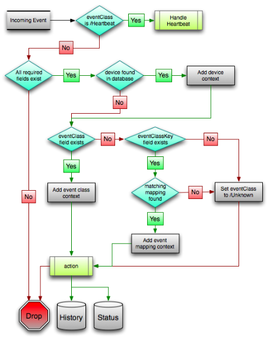

=====================================
Special Events and Their Consequences
=====================================

General Stuff
--------------------------

   Zenoss Events

Putting Events in Things
--------------------------

If you'd like to create an event in a modeler you can add these lines::

    import zope.component
    self._eventService = zope.component.queryUtility(IEventService)
    ........
    self._eventService.sendEvent(evt)

Here is an example ::

   def _deviceUp(self, result):
       msg = 'WMI connection to %s up.' % self._devId
       self._eventService.sendEvent(dict(
           summary=msg,
           eventClass=Status_Wmi,
           device=self._devId,
           severity=Clear,
           component='zenwin'))
       return result

   def _failure(self, result):
       """ Errback for an unsuccessful asynchronous connection. """

       err = result.getErrorMessage()
       log.error("Unable to scan device %s: %s", self._devId, err)

       self._reset()

       summary = """ Could not read Wins services (%s). Check your 6 """ % err

       self._eventService.sendEvent(dict(
           summary=summary,
           component='zenwin',
           eventClass=Status_Wmi,
           device=self._devId,
           severity=Error,
           ))

       return result

Clearing Events
---------------

In order for an event to *auto-clear* or automatically clear, the event
fingerprint must match for both events (the event that set the error and the
one that clears it). The fingerprint is composed of the following items:

* device
* component (can be blank)
* eventKey (can be blank)
* eventClass (including zEventClearClasses from event class configuration properties)

Reference: https://community.zenoss.org/docs/DOC-9437

INFO zen.ZenModeler Mesages
---------------------------

If you have messages that you get from the zen.ZenModeler that you want to
zoom in on, try these settings:

* set CollectorLogChanges to True
* remodel the device
* Look for closed info severity events in teh /Change event class
* You can also look in zenhub for events

  

